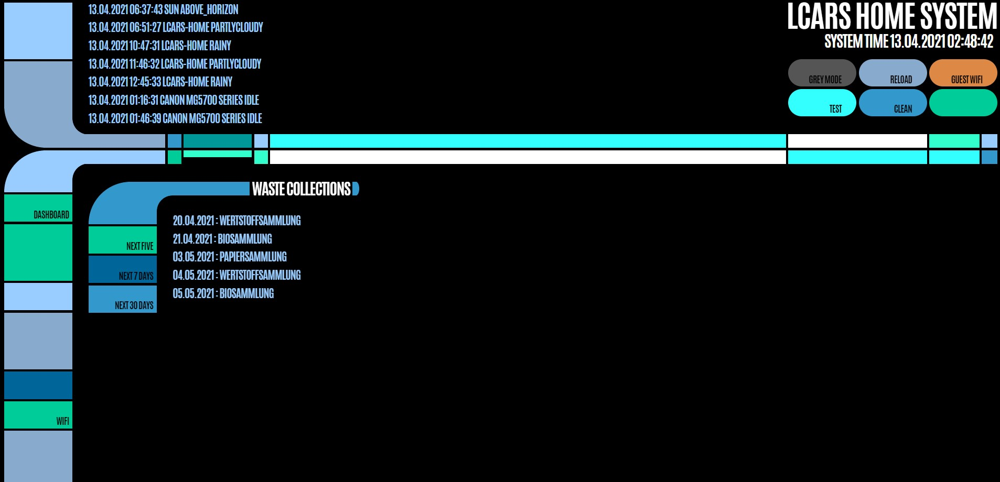

# LCARS-HomeSystem

# Introduction
This is a JS based web frontend that communicates with Home Assistants REST API. It is based on LCARS-SDK (https://github.com/crstmkt/LCARS-SDK) and brings the style of LCARS to your home!

# Installation
The code provided highly depends on my own HomeAssistant installation and won't work on yours without heavy modification. I tried to develop this as modular as I could but you still got to change some of the code, especially the communication with REST API.

This installation guide assumes you have basic understanding of how Home Assistants REST API works. For further information, please read the docs provided by the guys at Home Assistant.

# What you need
Network access to the \config\ folder of Home Assistant

# What do I have to do?
1. Within the \config\ folder of Home Assistant, you have to create a www\ folder. There you can place the files of this repository. You can also create subfolders like \LCARS-HomeSystem and \LCARS-HomeSystem_dev so you have one development "branch" and one "working" branch. 
2. In the js\API.js File, you have to paste your token and your Base-URL to establish communication to REST API.
3. At least the logbook should get some data now.
4. Within the "modules" Files (like Clean.js or Waste.js) you have to change the corresponding entityIDs so they fit your Home Assistant installation.

